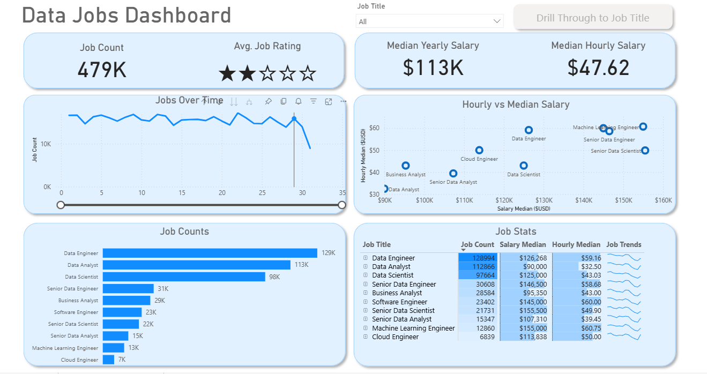

# 📊 Data Jobs Dashboard

An **interactive data analytics dashboard** that provides comprehensive insights into the data job market.  
It helps **job seekers, recruiters, and analysts** explore demand, compensation, job satisfaction, and hiring trends across various **data-related roles**.



---

## 🚀 Features

- 🔢 **Total Job Count:** 479K+ job postings analyzed  
- ⭐ **Average Job Rating:** Visual star-based representation of job satisfaction  
- 💰 **Median Salaries:**
  - **Yearly:** $113K
  - **Hourly:** $47.62  
- 📈 **Jobs Over Time:** Interactive line chart showing posting trends  
- 👨‍💻 **Job Counts by Role:**
  - Data Engineer – 129K
  - Data Analyst – 113K
  - Data Scientist – 98K
  - *...and more*
- 📊 **Hourly vs. Median Salary:** Compare compensation across roles  
- 🧾 **Detailed Job Stats Table:** Job count, salary medians, hourly rates, and trends  

---

## 🛠 Tech Stack

- 🐍 **Visualization:** Power BI – interactive charts, KPIs, slicers, and drill-through  
- 📉 **Analysis:** Salary distribution, demand trends, and rating comparisons  
- 🔧 **Version Control:** Git/GitHub for project versioning and documentation  

---

## 🔍 Key Insights

- 📌 **Data Engineers** and **Data Analysts** are the most in-demand roles  
- 💼 Median yearly salary is **$113K**, with hourly rates ranging from **$40 to $60+**  
- 🧠 **Machine Learning Engineers** and **Senior Data Engineers** top the hourly pay scale  
- 📅 Stable job demand with periodic fluctuations over time  

---

## 📥 How to Use

1. Clone this repository to your local machine:
   ```bash
   git clone https://github.com/2020s18006/Data-Job-Power-Bi-Dashboard-Project.git

